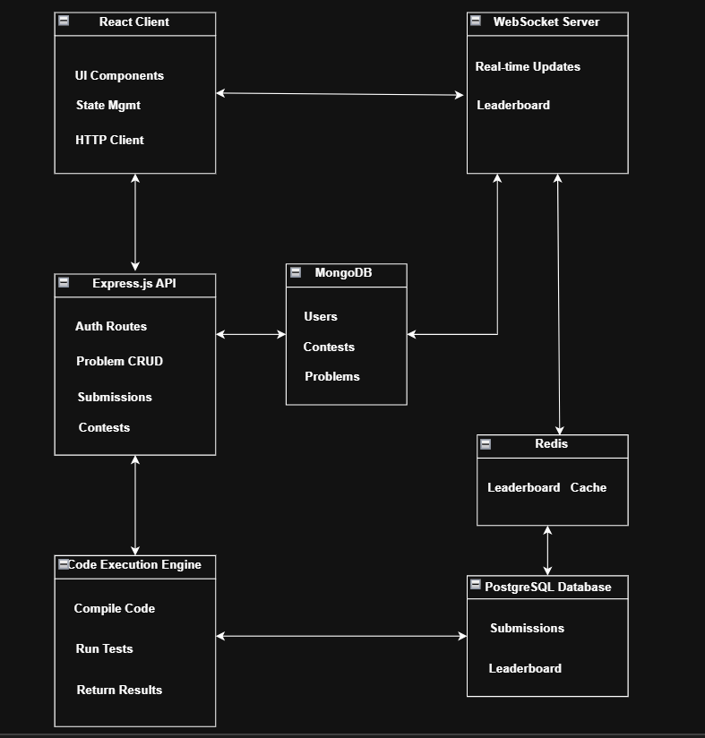

#  Competitive Programming Platform 

A full-featured online judge and competitive programming platform that allows users to solve coding problems, participate in contests, and compete on real-time leaderboards.

## Core Functionality

- **Problem Solving Engine** Submit and test solutions against multiple test cases.
- **Automated Testing**  Instant feedback with detailed test case results.
- **Code Execution** Secure environment for running user code.

## Contest System

- **Live Contests:** Real-time competitive programming contests.  
- **Contest Management:** Create, schedule, and manage programming contests.  
- **Problem Sets:** Curated problem collections for contests.  
- **Time-based Scoring:** Dynamic scoring based on submission time and attempts.  

# Real-time Features

- **Live Leaderboard:** Real-time ranking updates during contests.  
- **WebSocket Integration:** Instant updates for submissions and rankings.

# User Management

- **Authentication & Authorization:** Secure user registration and login.  
- **User Profiles:** Personal dashboards with solving history.  
# 🛠️ Tech Stack

## Frontend
- **React.js:** Modern UI with component-based architecture.  
- **JavaScript/ES6+:** Core frontend logic.  
- **CSS3/Styled Components:** Responsive and modern styling.  
- **WebSocket Client:** Real-time communication.

  ## Backend
- **Node.js:** Server-side JavaScript runtime.  
- **Express.js:** Web application framework.  
- **WebSocket:** Real-time bidirectional communication.  
- **JWT:** Secure authentication tokens.  

## Database & Caching
- **MongoDB:** Primary database for users, problems, and contests.  
- **PostgreSQL:** Submissions and leaderboard data storage.  
- **Redis:** Real-time leaderboard caching and session management.  

##  System Design


### Clone the Repository
```bash
git clone https://github.com/username/repository-name.git

